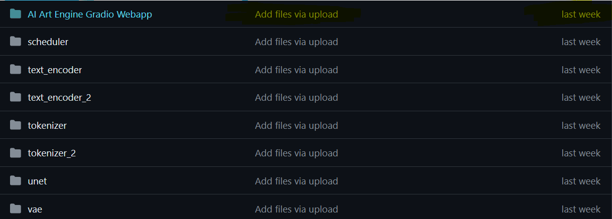
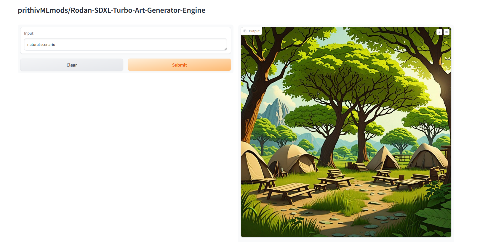

## SDXL Turbo  x  ComfyUI  x  Automatic1111

<Gallery />

**AUTOMATIC1111** : This could refer to a specific software or system named AUTOMATIC1111 that deals with tensor operations or machine learning tasks. The .safetensors extension might be used to save or serialize tensor data in a safe and structured manner.

**ComfyUI**: ComfyUI might be a user interface library or framework, and *.safetensors could be related to some functionality within it, perhaps for managing data or state related to tensors in a safe manner.

**InvokeAI**: If InvokeAI is a platform or tool related to artificial intelligence or machine learning, *.safetensors could be a file format used within it for storing tensor-related information securely.


## Use it with diffusers 🧨 
```python
from diffusers import AutoPipelineForText2Image
import torch
        
pipeline = AutoPipelineForText2Image.from_pretrained('Rodan-SDXL-Turbo-Art-Generator-Engine', torch_dtype=torch.float16).to('cuda')        
image = pipeline('A mecha robot in a favela', num_inference_steps=2).images[0]
```

ℹ️Recommended to Deploy inside Huggingface Workspaces

🚀Huggingface Model : https://huggingface.co/prithivMLmods/Rodan-SDXL-Turbo-Art-Generator-Engine

🚀Huggingface Spaces : https://huggingface.co/spaces/prithivMLmods/Art-Generator-Engine

ℹ️For the Deployment of Huggingface Workspaces Use Only the Highlighted Folder Mentioned & Choosing the correct SDK in Huggingface Spaces as follows; 





ℹ️Generated Images in Huggingface Spaces: 

🔮Prompt : " natural scenario "


